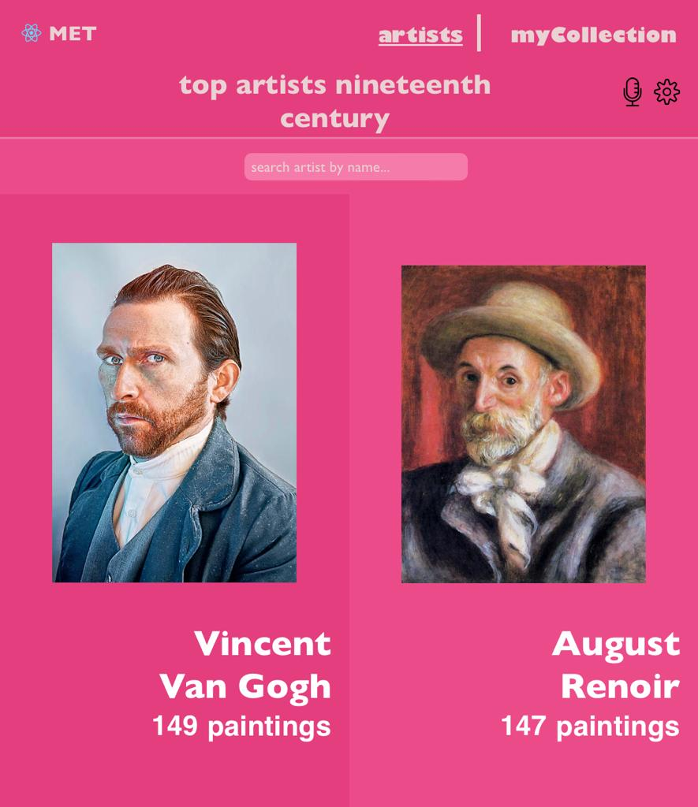

<a name="readme-top"></a>

<div align="center">
 
  
  <br/>

  <h3><b>MET Art App</b></h3>

</div>

# 📗 Table of Contents

- [📖 About the Project](#about-project)
  - [🛠 Built With](#built-with)
    - [Tech Stack](#tech-stack)
    - [Key Features](#key-features)
  - [🚀 Video Intro](#video-intro)
  - [🚀 Live Demo](#live-demo)
- [💻 Getting Started](#getting-started)
  - [Setup](#setup)
  - [Prerequisites](#prerequisites)
  - [Install](#install)
  - [Usage](#usage)
  - [Run Tests](#runtests)
  - [Deployment](#deployment)
- [👥 Authors](#authors)
- [🔭 Future Features](#future-features)
- [🤝 Contributing](#contributing)
- [⭐️ Show your support](#support)
- [🙏 Acknowledgements](#acknowledgements)
- [📝 License](#license)


# 📖 MET Art App <a name="about-project"></a>

**[MET Art App]** This Mobile App connects the user with the Metropolitan Art Museum of New York API and display NINETEENTH CENTURY TOP ARTISTS.  When you click an artists image you can access to all their paintings available in MET with main details like title, year of creation and medium. My Collection is an additional feature that allows you to select your favorite paintings and store it. Built with REACT & REDUX, is my Capstone Project for Module 3. You can check the MET APi in this URL https://metmuseum.github.io/#search.

## 🛠 Built With <a name="built-with"></a>
1- REACT<br>
2- REDUX TOOLKIT


### Tech Stack <a name="tech-stack"></a>

<details>
  <summary>Client</summary>
  <ul>
    <li><a href="https://github.com/"></a>GitHub</li>
    <li><a href="https://youtube.com/"></a>YouTube</li>
    <li><a href="https://www.microverse.org"></a>Microverse</li>
    <li><a href="https://www.metmuseum.org/"></a>The MET</li>
  </ul>
</details>

### Key Features <a name="key-features"></a>

- **[Added App.js]**
- **[Added App.css]**
- **[Added index.css]**
- **[Added index.js]**
- **[Added /src]**
- **[Added /public]**
- **[Added /src/components]**
- **[Added /src/redux]**
- **[Added /src/test]**
- **[Added linters]**


<p align="right">(<a href="#readme-top">back to top</a>)</p>

## 🚀 Video Intro <a name="video-intro"></a>

[Video Intro](https://www.loom.com/share/68946f697e514b6586c6972875eec606?sid=fd795b60-2916-453e-9615-b9fb5c4a89c8/)

<p align="right">(<a href="#readme-top">back to top</a>)</p>

## 🚀 Live Demo <a name="live-demo"></a>

[MET Art App](https://met-app.onrender.com/)

<p align="right">(<a href="#readme-top">back to top</a>)</p>


## 💻 Getting Started <a name="getting-started"></a>

To get a local copy up and running, follow these steps.

### Prerequisites

In order to run this project you need:

Web Browser (Chrome recommended)<br>
Code editor (VS recommended)<br>
GitHub account<br>
Node.js environment

### Setup

Clone this repository to your desired folder:

```sh
  cd my-folder
  git clone "https://github.com/JuanDBta/met-art-app.git"
```
### Install

Install this project executing the following command:

```sh
  npm install
```

### Usage

To run the project, go to /met-art-app directory and execute the following command:

```sh
npm start
```

### Run Tests

To run the test, execute the following command:

```sh
npm run test
```

### Deployment

You can deploy this project using:<br>[MET Art App](https://met-app.onrender.com/)


<p align="right">(<a href="#readme-top">back to top</a>)</p>

## 👥 Authors <a name="authors"></a>

👤 **Micronaut JUAN DAVID DIAZ**

- GitHub: [@JuanDBta](https://github.com/JuanDBta)
- Twitter: [@simplebetsas](https://twitter.com/simplebetsas)
- LinkedIn: [LinkedIn](https://linkedin.com/in/simplebet/)

<p align="right">(<a href="#readme-top">back to top</a>)</p>

## 🔭 Future Features <a name="future-features"></a>

- [ ] **[Add Animations and Awsome Styling]**

<p align="right">(<a href="#readme-top">back to top</a>)</p>

## 🤝 Contributing <a name="contributing"></a>

Contributions, issues, and feature requests are welcome!

Feel free to check the [issues page](../../issues/).

<p align="right">(<a href="#readme-top">back to top</a>)</p>

## ⭐️ Show your support <a name="support"></a>

If you like this project, please give me a like, it doesn't cost you anything and it helps me a lot to keep working.

<p align="right">(<a href="#readme-top">back to top</a>)</p>

## 🙏 Acknowledgments <a name="acknowledgements"></a>

I would like to thank Bee in Student Success who is always avalaible to solve issues and Microverse for push us to work hard every day!

The Crypto-Pro template was created by Nelson Sakwa and is used under the CC BY-NC 4.0 (https://creativecommons.org/licenses/by-nc/4.0/). Changes have been made to the original template.

Original Template: https://www.behance.net/gallery/31579789/Ballhead-App-(Free-PSDs)

<p align="right">(<a href="#readme-top">back to top</a>)</p>

## 📝 License <a name="license"></a>

This project is [MIT](./LICENSE) licensed.

<p align="right">(<a href="#readme-top">back to top</a>)</p>

